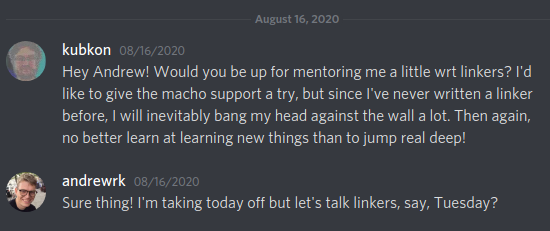

# Jakub Konka Hired Full Time

Thanks to continued growth of our generous donors, Zig Software Foundation's
financial status is healthier than ever. With our low overhead and efficient
organization structure, we point the flow of money directly towards contributors.

One way we are experimenting with this is having ZSF sponsor contributors via
[GitHub Sponsors for Organizations](https://github.com/sponsors). In particular,
ZSF is sponsoring:

 * [Rich Felker](https://github.com/richfelker/), as thanks for working
   on [musl libc](http://musl.libc.org/).
 * [Meghan](https://github.com/nektro/), as thanks for working on packages in the burgeoning
   Zig ecosystem.

We're looking forward to adding to this list as more people in the Zig ecosystem
get signed up for GitHub Sponsors!

As for core contributors to the Zig project, we raised our ambitions. We now want to
offer full time hours to those who freelance work on Zig.

As a start, [VP of Community Loris Cro](https://kristoff.it/) now has a well-deserved
full-time pool of hours to draw from.

Finally, the big news item for today...

**I am incredibly pleased to announce that [Jakub Konka](http://www.jakubkonka.com/) decided to
[leave his Microsoft employment in favor of full-time work on Zig!](https://twitter.com/kubkon/status/1377146321136537602)**

I want to take a little bit of time to celebrate the work he has done so far.
Just a few short months ago, Jakub reached out to me with this message:

I recommended [Linkers & Loaders](https://linker.iecc.com/), and he was instantly hooked.
Jakub went down a deep rabbit hole but
[emerged victorious](https://github.com/ziglang/zig/pull/8282).
What an incredible accomplishment, going from no experience, to upstreaming a new
linker capable of cross-compiling, in just 6 months *while working a day job*.

Not to mention he had to reverse engineer the aarch64 Mach-O object format, since Apple
has not yet released source code for the new ld64 release that supports M1 CPUs, and
[LLD](https://lld.llvm.org/) has no aarch64-macos support yet. I don't know what Microsoft
had him working on there, but I suspect they deeply underestimated his talents.

It's a bold decision to make,
[quitting a cushy job to follow your dreams](https://andrewkelley.me/post/full-time-zig.html).
I'm honored that Jakub decided to take the plunge, and I will do everything in my power to
make it worth it for him, from compensation, to meeting social or organizational needs, to
professional growth.

I noticed that Rust Foundation addressed this topic recently. They made the decision to
[not hire anyone directly](https://github.com/rust-lang/foundation-faq-2020/blob/main/FAQ.md#q-hiring),
opting instead to try to help core contributors land employment at other companies:

> Why not hire folks? For one thing, we don’t think a Foundation would be able to pay them
> what they’re worth or support them in the way they should be supported. We would have to
> hire human resourcing people, managers, figure out peoples’ design goals and career path,
> and do all the other things that a good employer does, and that is not practical.

I think it's a wise move on their part. They have some major players on their board of
directors (Microsoft, Huawei, Amazon, Google), and have positioned Rust as a project that
these large corporations, although competing in their respective markets, have a sort of
"truce" because they mutually benefit from Rust, and are thus incentivized to donate
employee time to the project. This can scale to a large number of Rust contributors;
they've basically decentralized compensation.

However, **Zig Software Foundation will never have big tech companies on the board
of directors.** We are grateful to [Pex](https://pex.com/), for example, for donating
$5,000/month, even though they have no [board seats](/zsf/#board-members). Our goal is to maintain
independence by keeping the mix of donations balanced among many parties.

We have to be very careful to treat our contractors with respect and
make sure their needs are met. The quote above makes an excellent
point that a good employer has the responsibility to meet various needs of their employees.

First and foremost it means we must compensate well. Right now we are paying 50 USD per hour,
but I would like to see this raised to 75 within the next two years. Contractors do not
receive medical insurance or other employment perks, so the hourly wage must be higher to
account for that.

The main trick ZSF has up its sleeve to avoid hiring any managers or human
resourcing people, is to have a flat organization structure. By hiring contributors
who are self-directed and intrinsically motivated, compensating them well, and then
**giving them the freedom to work on what they choose**, the need for managers is almost
entirely eliminated. What's left looks a lot like peers collaborating with each other, and
does not itself consume a full-time role.

We do not have enough money yet to offer this to all core team members. Currently,
Zig Software Foundation takes in $17,065/month via GitHub Sponsors, for which we are
grateful.

Our next goal is $35,000/month, allowing us to offer this to 2 more people. If you would
like to help us reach the goal, [become a sponsor](https://github.com/sponsors/ziglang/).
There are two new features of GitHub Sponsors that you can take advantage of:

 * Custom donation amounts
 * One time donations

I enabled them in the settings; please let me know if you run into a problem.
See also [other ways to donate](/zsf/#additional-donation-methods-supported).

Thanks for your time, 
Andrew
